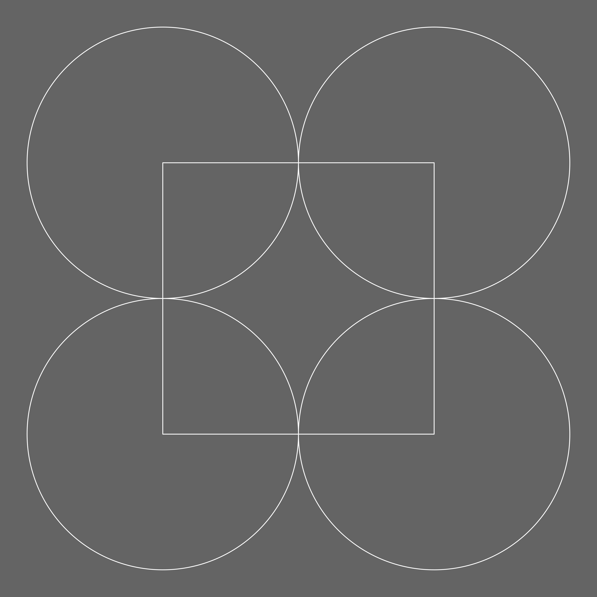
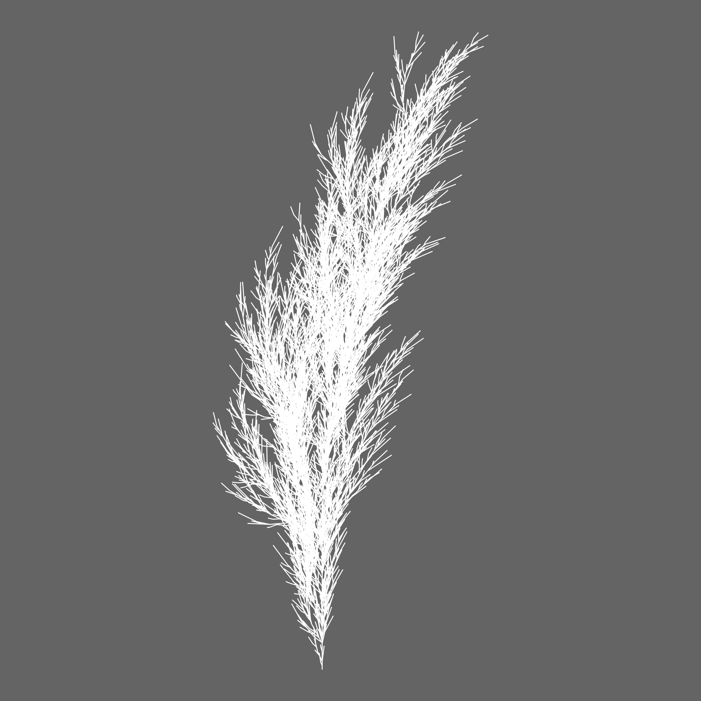

## Instructions

Lindenmoji renders
[Lindenmayer systems](https://en.wikipedia.org/wiki/L-system). You may specify
an L-system by specifying an initial condition, defining rules, and defining
settings.

These are valid L-systems that draw a single line:

`F`
`a; a=F`

The initial condition is the rule `a`, which contains only the command `F`--the
command to move the cursor forward and draw a line (which may also be invoked
with ➡️ and →).

A more complex system looks like this:

`aaaa; a=FO+; 📐=90`

This defines an initial condition of `aaaa` ("do rule `a` four times") and
defines `a` as "draw a line", "draw a circle", and "rotate by the rotation
angle". `📐` is a setting that specifies the rotation angle, in this case 90
degrees. The output is a square with a circle drawn at each corner:

An even more complex system that draws a leaf looks like this:

`F; F=F[++F[-F]]F[-FF[F]]; 📐=12; 〰️=0.8; 🍥=0.6`

This system draws the
[Peano-Gosper curve](https://en.wikipedia.org/wiki/Gosper_curve), it's the
first example to define more than one rule:

`Fx; x=x+yF++yF-Fx--FxFx-yF+; y=-Fx+yFyF++yF+Fx--Fx-y; 📐=60`

### Commands

#### ➡️, →, `F`

Draw a line in the direction of the heading. Takes an optional length.

#### ⤵️, `M`

Move the cursor in the direction of the heading. Takes an optional length.

#### ↪️, ↪, `-`

Rotate the heading counter-clockwise by the rotation angle.

#### ↩️, ↩, `+`

Rotate the heading clockwise by the rotation angle.

##### ⬜️

Draw an empty square. Takes an optional size.

#### ⬛️

Draw a filled square. Takes an optional size.

#### ⭕️, `O`

Draw en empty circle. Takes an optional size.

#### 🔴

Draw a filled circle. Takes an optional size.

#### 📐

Rotate the heading by the specified positive or negative angle.

#### 🎨

Set the line color. There are approximately 10 colors available.

#### `[`

Store the current state.

#### `]`

Go back to the previous state.

### Settings

#### 📐

Set the global rotation angle.

#### 🌇

Specify a gradient background. There are approximately 7 backgrounds available.

#### 🍥

Set the variation in angle.

#### 〰️

Set the variation in distance.

#### 🎨

Set the default line color.
